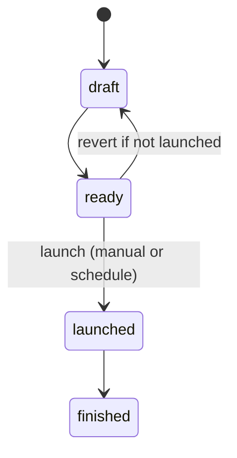

# Diagrams

Use **Mermaid** inside Obsidian notes (code fence `mermaid`) or export PNG into this folder and embed with `![[diagrams/Entity ER.png]]`.

## Recommended diagrams

| Topic | Type | Lives in |
|-------|------|----------|
| Campaign lifecycle | `stateDiagram-v2` | [[processes/Campaign lifecycle]] |
| Ownership transfer | `sequenceDiagram` | [[processes/Ownership transfer]] |
| Entity relationships | `erDiagram` | [[data-model/Overview]] |
| Vote submission | `sequenceDiagram` | [[processes/Cast and change vote]] |

## Snippet — state diagram shell

## Related

- [[Home]]
